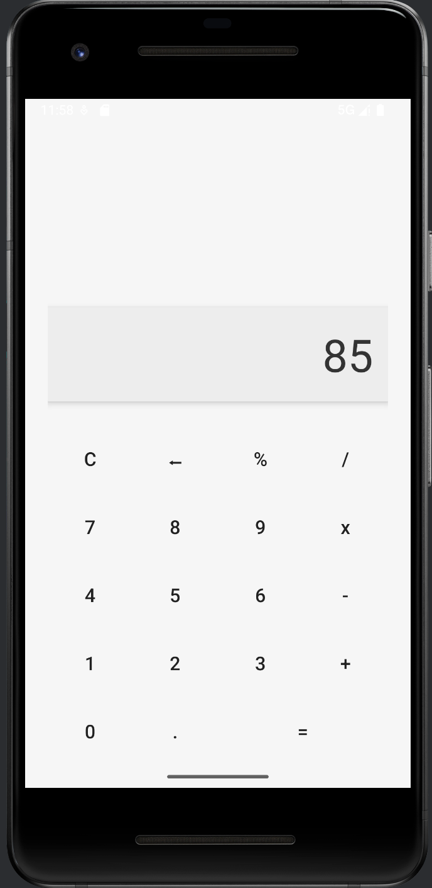

# 📱 감성 계산기 - GhatGptnumber

  
  

---

## 🧠 소개

이 계산기 앱은 **디자인과 감성까지 챙긴 계산기**입니다.  
숫자만 누르기 아까운 ✨ 이쁜 계산기 ✨를 찾는 사람들을 위한  
**AI와 함께 만든** 안드로이드 애플리케이션입니다.

> Android Studio에서 Java + XML로 작성되었습니다.

---

## ✨ 주요 기능

| 기능 | 설명 |
|------|------|
| 🔢 사칙 연산 | `+`, `-`, `×`, `÷`, `%` 모두 지원 |
| 🧼 초기화 & 한 글자 지우기 | `C` 버튼, `←` 버튼 |
| 📱 예쁜 UI | 부드러운 색상 + 둥근 버튼 |
| 💜 버튼 감성 | 보라 계열 포인트 컬러 + 강조 버튼 |

---

## 📸 스크린샷

  

---

## 🛠 개발 환경

- **언어**: Java
- **UI**: XML + Material 스타일
- **IDE**: Android Studio
- **minSdk**: 21 (Lollipop)

---

## 🚀 실행 방법

1. Android Studio에서 이 프로젝트 열기  
2. 에뮬레이터 또는 연결된 디바이스로 실행  
3. `MainActivity` 기준으로 앱 실행

---

## 📁 폴더 구조

``bash
GhatGptnumber/
├── MainActivity.java
├── activity_main.xml
├── styles.xml
├── rounded_button.xml
└── readme.md

🤖 제작
이 프로젝트는 **ChatGPT(생성형 AI)**의 도움으로 코딩되었습니다.
코드뿐 아니라 디자인도 함께 설계한 100% AI 빌드 앱입니다.

개발자: 권법진
디자인/기획/코딩 보조: ChatGPT
