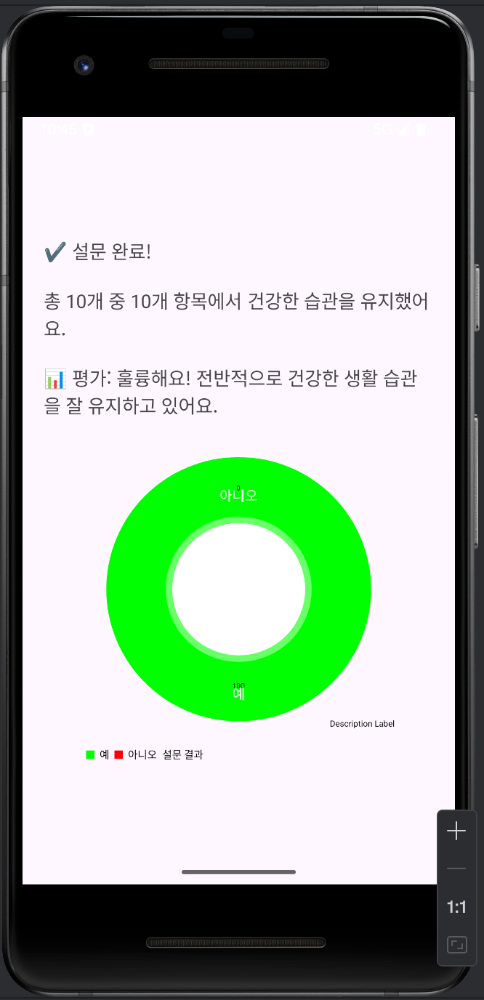
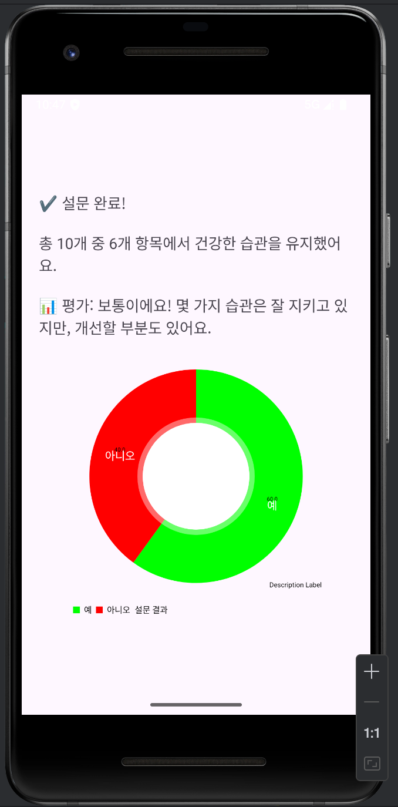
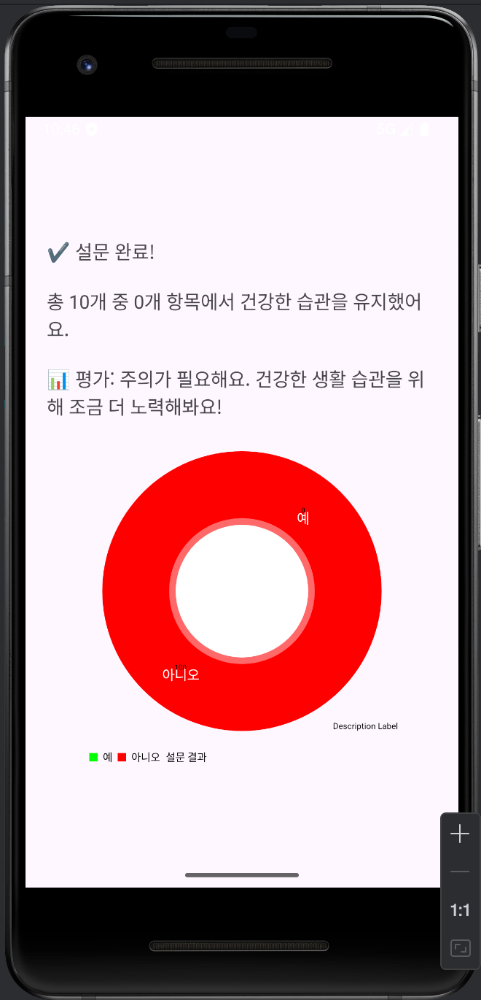

# 📱 하루 생활 습관 체크 설문 앱 (Survey App)

이 앱은 Android Studio를 활용해 제작된 설문조사 앱으로, 사용자가 하루 동안 건강한 생활 습관을 얼마나 유지했는지를 간단한 질문을 통해 확인할 수 있습니다.  
결과는 텍스트와 그래프로 시각적으로 제공됩니다.

---

## 📌 주요 기능

- ✅ 10개의 생활 습관 질문 (예/아니오)
- ✅ 응답에 따른 점수 계산
- ✅ 점수에 따른 텍스트 피드백 제공
- ✅ MPAndroidChart 라이브러리를 이용한 원형 그래프 시각화

---

## 📁 폴더 구조

Coding Challenge/
│
├── java/
│ ├── MainActivity.java # 시작 화면
│ ├── QuestionActivity.java # 설문 질문 순서대로 출력
│ ├── ResultActivity.java # 결과 및 그래프 출력
│ └── SurveyData.java # 질문 목록과 응답 저장 클래스
│
├── layout/
│ ├── activity_main.xml
│ ├── activity_question.xml
│ └── activity_result.xml
│
├── AndroidManifest.xml
├── build.gradle.kts
├── settings.gradle.kts
└── readme.md

yaml
복사
편집

---

## 🎮 실행 화면 흐름

1. **MainActivity**  
   - "설문 시작하기" 버튼 클릭 시 설문 시작
2. **QuestionActivity**  
   - 질문 10개에 대해 순차적으로 "예 / 아니오" 응답
3. **ResultActivity**  
   - 전체 응답 결과를 바탕으로 점수 계산
   - 점수에 따른 피드백 + 원형 그래프 표시

---

## 📸 결과 화면 예시

사용자가 설문을 마치면 응답 비율에 따라 아래와 같은 결과 화면이 표시됩니다:

### 🟢 건강한 습관 유지 (Good)


---

### 🟡 보통 상태 (Soso)


---

### 🔴 주의가 필요한 상태 (Bad)


## 📊 그래프 라이브러리

MPAndroidChart 사용:  
[https://github.com/PhilJay/MPAndroidChart](https://github.com/PhilJay/MPAndroidChart)

```kotlin
// Module: app/build.gradle.kts
implementation("com.github.PhilJay:MPAndroidChart:v3.1.0")
kotlin
복사
편집
// settings.gradle.kts
dependencyResolutionManagement {
    repositories {
        google()
        mavenCentral()
        maven(url = "https://jitpack.io")
    }
}
💬 사용된 프롬프트
scss
복사
편집
나는 안드로이드 스튜디오로 설문조사 앱을 만들거야. 폴더 이름은 Survey이고 주제는 자유라 너가 하고싶은 아무거나해도 상관없어.(레포트용) 항목은 10개 이상이여야해. 마지막 화면에는 설문결과를 텍스트와 그래프로 표현하면 좋겠어. 제작과정과 너에게 적은 프롬프트를 깃허브 readme.md에 작성을할꺼야
🛠 제작 과정 요약
Java 파일 4개 생성 및 설문 로직 구현

XML 레이아웃 3개 제작 (메인/질문/결과)

MPAndroidChart 라이브러리 연결

결과 화면에 퍼센트 계산 + 분석 텍스트 출력 + 원형 차트 출력

GitHub 업로드 및 폴더 구조 정리

👨‍💻 개발 환경
Android Studio Electric Eel

Java

Gradle Kotlin DSL

Android SDK 31+


