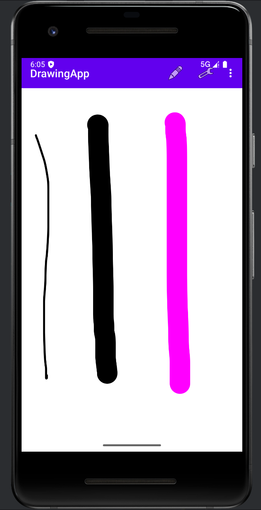

# 🖌️ DrawingApp (그림판 앱)

간단하면서도 실용적인 **안드로이드 그림판 앱**입니다.  
사용자는 손가락으로 자유롭게 그림을 그리고, 다양한 색상과 굵기를 설정할 수 있으며 지우개, 전체 삭제, 실행 취소 등의 기능을 사용할 수 있습니다.

---

## 📸 앱 스크린샷
| 메인 화면 | 
|-----------|
|  

> 📁 `screenshots/` 폴더를 만들고 `main.png`, `menu.png` 이미지를 넣어주세요

---

## 🎯 주요 기능

- 🎨 색상 선택 (팝업 다이얼로그)
- ✏️ 선 굵기 입력 (숫자 직접 입력)
- 🧼 지우개 기능 (배경색으로 드로잉 삭제)
- 🗑 전체 지우기
- ↩ 되돌리기 (undo)
- 🧭 툴바 기반 메뉴 인터페이스로 개선된 UX

---

## 🧠 SWOT 분석

| 구분 | 내용 |
|------|------|
| ✅ **Strengths (강점)** |  
- 간단한 구조와 직관적인 UI  
- 다양한 색상/굵기 지원  
- 툴바 기반 메뉴로 UX 개선  
| 🧪 **Weaknesses (약점)** |  
- 실행 취소는 1단계만 가능  
- 저장/공유 기능 미구현  
- 색상 커스터마이징 한계 있음  
| 🚀 **Opportunities (기회)** |  
- 학습용 프로젝트로 구조가 명확함  
- 저장 기능, 이미지 삽입, 공유 기능 추가 확장 가능  
- 교사·학생용 낙서앱으로도 활용 가능  
| ⚠️ **Threats (위협)** |  
- Google Keep, Samsung Notes 등 경쟁 앱 존재  
- 단순한 기능만으로는 차별화 어려움  

---

## 🧩 기술 스택

- 🧱 Java + Android Studio
- 🎨 XML 기반 커스텀 View
- 📐 Toolbar + PopupMenu
- 📦 SQLite (향후 저장 기능 확장 가능)

---

## 📁 프로젝트 구조

DrawingApp/
├── java/com/example/drawingapp/
│ ├── MainActivity.java
│ ├── DrawingView.java
├── res/
│ ├── layout/activity_main.xml
│ ├── menu/menu_main.xml
│ ├── values/colors.xml
│ ├── values/themes.xml
├── screenshots/
│ ├── main.png
│ └── menu.png

---

## 📌 향후 추가 예정 기능

- 이미지 저장 및 공유
- 배경 이미지 설정
- 다중 undo/redo
- 텍스트 추가 기능

---

## 👨‍💻 개발자
**권법진**  
📧 gwonbubjin@gmail.com  
📘 GitHub: [gwonbubjin](https://github.com/gwonbubjin)

