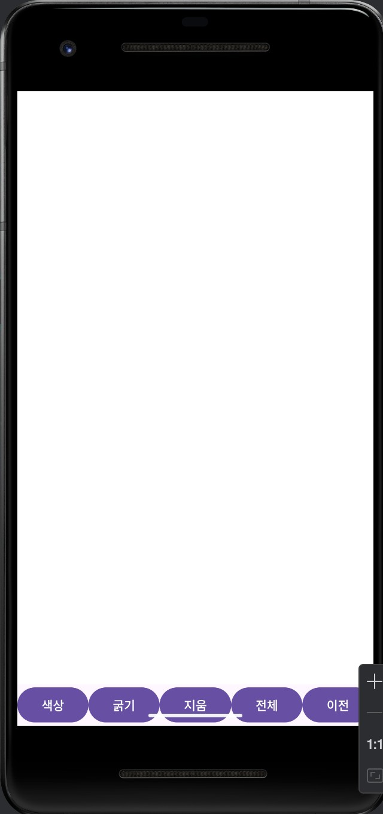

# 🎨 Android 그림판 앱 (Drawing App - Java)



> **손가락으로 자유롭게 그리고, 지우고, 되돌리는 Android 그림판 앱**  
> Java 기반으로 구현된 이 앱은 핵심적인 드로잉 기능만을 간결하게 제공하여, 교육용이나 기초 앱 프로젝트로 최적화되어 있습니다.

---

## 🔍 프로젝트 개요

- **플랫폼**: Android (Java, Android Studio)
- **목표**: 최소한의 핵심 기능으로 동작하는 그림판 앱 개발
- **특징**:
  - 터치 기반 드로잉
  - 색상 선택 다이얼로그
  - 굵기 수치 입력
  - 지우개 모드 및 되돌리기 기능 포함

---

## 🧠 SWOT 분석 기반 기능 기획

| 항목 | 내용 |
|------|------|
| ✅ **Strengths** |  
• **가볍고 직관적인 인터페이스**: Java + Custom View 기반으로 성능 최적화<br>• **기초 기능 충실**: 드로잉, 색상, 굵기 조절, 지우개, undo 등 완비<br>• **교육/입문용으로 적합**: 코드 구조 단순화로 학습에 최적 |
| ⚠️ **Weaknesses** |  
• **Redo 기능 부재**: undo만 지원되고 재실행 기능은 미지원<br>• **이미지 저장 및 공유 기능 없음**<br>• **디자인 요소 미흡**: 버튼 스타일과 UX 요소가 단순 |
| 🚀 **Opportunities** |  
• **교육 콘텐츠로 활용 가능**: 유아/초등 낙서 앱, 디지털 필기 학습용<br>• **기능 확장 여지 큼**: 브러시팩, 배경 추가, 저장 기능 등 상용화 가능<br>• **오픈소스 공개를 통한 기여 유도 가능** |
| ⛔ **Threats** |  
• **경쟁 앱 다수 존재**: Play스토어에 다양한 고급 드로잉 앱 존재<br>• **고급 사용자 만족도 부족 우려**<br>• **다양한 해상도 대응 미흡 시 UX 저하 위험**

---

```bash
📁 images/
 ┗ 🖼️ screenshot.png
🛠️ 기술 스택
항목	사용 기술
언어	Java
IDE	Android Studio
UI	Custom View (Canvas + Path)
버전	Android API 21+

🚧 향후 개선 사항 (약점 보완 로드맵)
 이미지 저장 기능 추가 (PNG 저장)

 Redo (다시 실행) 기능 구현

 다양한 브러시 스타일 (형광펜, 점선 등)

 UI/UX 향상 (아이콘 버튼, 애니메이션)

 다국어 지원 및 고해상도 대응

🧑‍💻 개발자 정보
Gwon Bubjin
📧 Email: gwonbubjin@gmail.com
📎 GitHub: github.com/gwonbubjin

이 프로젝트는 최소 기능 중심의 그림판 구조를 통해 SWOT 분석 기반의 기능 설계와 개선 방향 제시를 학습하는 데 중점을 두었습니다.
