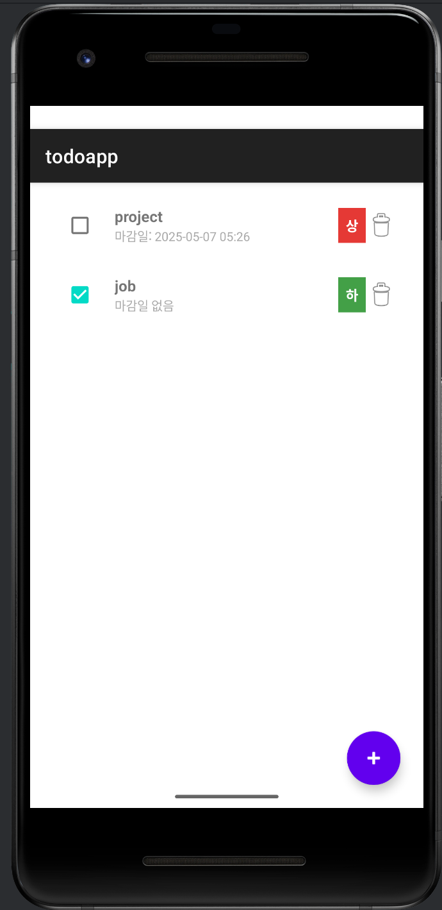

# ✅ 투두앱 (Java + SQLite)

**Java와 SQLite**를 기반으로 만든 강력한 투두리스트 앱입니다. 사용자에게 친숙한 **Material Design UI**와 함께, 할 일을 효과적으로 관리할 수 있는 기능들을 갖추고 있습니다.

---

## 🌟 주요 기능

| 기능        | 설명                                        |
| --------- | ----------------------------------------- |
| ✅ 할 일 추가  | 제목, 마감일, 우선순위를 다이얼로그로 입력                  |
| 🕒 마감일 설정 | 날짜와 시간 선택 기능 포함 (DatePicker + TimePicker) |
| ⚡ 우선순위 표시 | "상/중/하"에 따라 색상 구분 표시                      |
| ☑ 완료 체크   | 체크박스를 통해 완료 여부 확인 가능                      |
| 🗑 삭제 기능  | 리스트에서 손쉽게 제거 가능                           |
| 📦 로컬 저장  | SQLite를 이용한 영구 데이터 저장                     |
| 🔄 실시간 반영 | RecyclerView를 통한 리스트 실시간 업데이트             |

---

## 🖼 앱 화면 예시

> 아래에 스크린샷을 넣을 수 있습니다. `/images` 폴더에 이미지를 저장한 후 링크로 연결하세요:

```markdown


```

---

## 🔍 SWOT 분석

| 구분                                    | 내용 |
| ------------------------------------- | -- |
| ✅ **강점 (Strengths)**                  |    |
| • Java + SQLite 기반으로 누구나 이해 가능        |    |
| • 현대적 UI (Material Design 3)          |    |
| • 우선순위 및 마감일 입력 기능 포함                 |    |
| • 다이얼로그 구조 분리로 유지보수 쉬움                |    |
| ⚠ **약점 (Weaknesses)**                 |    |
| • 알림 기능 없음                            |    |
| • 태그/카테고리 분류 불가                       |    |
| • 검색/정렬 기능 미지원                        |    |
| • 클라우드 백업 없음                          |    |
| 🚀 **기회 (Opportunities)**             |    |
| • 생산성 앱 시장의 높은 수요                     |    |
| • Firebase 연동 시 확장성 뛰어남               |    |
| • 사용자 피드백 기반 기능 추가 가능                 |    |
| • 다크모드/테마 지원 확장 여지                    |    |
| ⛔ **위협 (Threats)**                    |    |
| • Kotlin/Jetpack Compose 기반 최신 앱들과 경쟁 |    |
| • 앱스토어에 유사 앱 다수 존재                    |    |
| • 고급 기능이 빠지면 차별성 약함                   |    |

---

## 🛠 사용 기술

* **Java (Android)**
* **SQLite (내장형 데이터베이스)**
* **Material Design Components 3**
* **RecyclerView + Adapter 구조**
* **Custom Dialog (AlertDialog + Layout)**

---

## 📁 폴더 구조

```
todoapp/
├── MainActivity.java             # 메인 로직 및 RecyclerView 구성
├── AddTaskDialog.java           # 할 일 추가 다이얼로그
├── TaskAdapter.java             # RecyclerView 어댑터
├── TaskDatabaseHelper.java      # SQLite CRUD
├── Task.java                    # 모델 클래스
└── res/layout/
    ├── activity_main.xml        # 메인 화면 레이아웃
    ├── item_task.xml            # 리스트 아이템 디자인
    └── dialog_add_task.xml      # 다이얼로그 입력창
```

---

## 🧩 개선 예정 기능

* 🔔 마감일 기반 알림(Notification)
* ☁ Firebase 연동으로 백업/복원 기능
* 🏷 태그/카테고리별 분류 기능
* 🔍 검색 & 정렬 기능
* 🌓 다크모드 전환 / 커스텀 테마
* 📊 완료율 통계, 달력 뷰 등 고급 UI

---

## 📜 라이선스

이 프로젝트는 개인/학습용입니다. 자유롭게 수정 및 활용 가능하며, 상업적 사용 시 저작권자에게 문의해주세요.

---

**💙 제작자: \[Gwonbubjin]**

